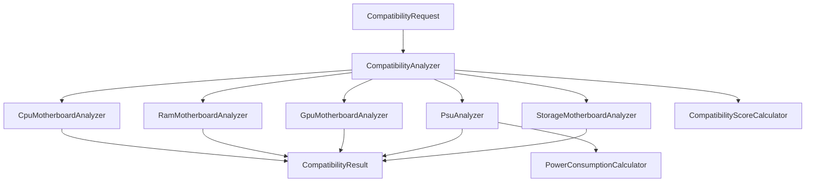

# compatibility-lib

Librería Java 21 reutilizable para validar compatibilidad entre componentes de computador. El proyecto está pensado como un JAR consumible desde otros proyectos Maven, con diseño modular, arquitectura limpia y reglas de compatibilidad explícitas.

El proyecto sigue siendo una librería. Para contenedores se agregó un adaptador mínimo de ejecución para validar el JAR en Linux, Docker y AWS sin alterar analyzers, calculators, builders ni records.

## Arquitectura



La librería separa responsabilidades en capas pequeñas:

- `models`: objetos de dominio inmutables.
- `enums`: tipos cerrados para sockets, RAM, PCIe y estados de compatibilidad.
- `analyzers`: reglas de compatibilidad por componente y orquestación central.
- `calculators`: reglas cuantitativas para energía y score.
- `utils`: validaciones y funciones compartidas.
- `factory`: creación conveniente de componentes.
- `config`: constantes de la librería.

## Reglas de compatibilidad

- CPU y motherboard deben compartir socket.
- RAM y motherboard deben coincidir en tipo, soportar la capacidad total, slots y velocidad.
- GPU y motherboard deben ser compatibles por PCIe; una GPU más nueva en una motherboard más vieja genera warning.
- PSU se calcula con CPU TDP + GPU wattage recomendado + 25% de margen.
- Storage debe ser soportado por la motherboard según SATA o M.2/NVMe.

## Uso

```java
CompatibilityRequest request = CompatibilityRequest.builder()
        .cpu(ComponentFactory.cpu("AMD", "Ryzen 7 7700", CpuSocket.AM5, 8, 16, 120, true, BigDecimal.valueOf(300)))
        .gpu(ComponentFactory.gpu("NVIDIA", "RTX 4070", "Ada", 12, 200, PcieVersion.PCIE_4, 240, BigDecimal.valueOf(700)))
        .ram(ComponentFactory.ram("Corsair", "Vengeance", RamType.DDR5, 32, 5600, 1.25d, 2, BigDecimal.valueOf(180)))
        .motherboard(ComponentFactory.motherboard("ASUS", "Prime", CpuSocket.AM5, RamType.DDR5, 128, 4, 6000, PcieVersion.PCIE_5, FormFactor.ATX, 4, 2, BigDecimal.valueOf(250)))
        .psu(ComponentFactory.psu("Corsair", "RM750", 750, "80+ Gold", true, FormFactor.ATX, BigDecimal.valueOf(160)))
        .storage(ComponentFactory.storage("Samsung", "990 Pro", StorageType.NVME, "M.2", 1000, 7450, 6900, BigDecimal.valueOf(140)))
        .build();

CompatibilityResult result = new CompatibilityAnalyzer().analyze(request);
```

## Generar el JAR

```bash
./mvnw clean verify
```

En Windows:

```bat
mvnw.cmd clean verify
```

En Linux o macOS:

```bash
./mvnw clean verify
```

## Ejecutar en Docker

La imagen construye la librería con Java 21, copia el JAR generado y ejecuta un smoke run de la fachada principal.

```bash
docker build -t compatibility-lib:1.0.0 .
docker run --rm compatibility-lib:1.0.0
```

Si prefieres Docker Compose para validación local:

```bash
docker compose up --build
```

## AWS

Estructura recomendada para despliegue:

- `ECR`: almacenar la imagen Docker versionada.
- `ECS`: ejecutar el contenedor como tarea o servicio si necesitas orquestación.
- `EC2`: ejecutar la imagen directamente con Docker cuando quieras control total del host.

Flujo recomendado:

```bash
aws ecr create-repository --repository-name compatibility-lib
aws ecr get-login-password --region <region> | docker login --username AWS --password-stdin <account-id>.dkr.ecr.<region>.amazonaws.com
docker tag compatibility-lib:1.0.0 <account-id>.dkr.ecr.<region>.amazonaws.com/compatibility-lib:1.0.0
docker push <account-id>.dkr.ecr.<region>.amazonaws.com/compatibility-lib:1.0.0
```

Para ECS o EC2, usa esa misma imagen y define recursos de CPU/memoria según el consumo esperado. No necesitas una librería `.so`; este proyecto es Java puro y el JAR dentro de un contenedor Linux cubre el requisito técnico salvo que agregues JNI o código nativo.

## Importar en otro proyecto Maven

```xml
<dependency>
    <groupId>com.techplanner</groupId>
    <artifactId>compatibility-lib</artifactId>
    <version>1.0.0-SNAPSHOT</version>
</dependency>
```

## Calidad

- Java 21
- Maven Wrapper
- JUnit 5
- Mockito
- JaCoCo con cobertura mínima del 85%
- JavaDoc en las clases públicas
- Diseño desacoplado y reusable
- Imagen Docker multietapa para Linux/AWS